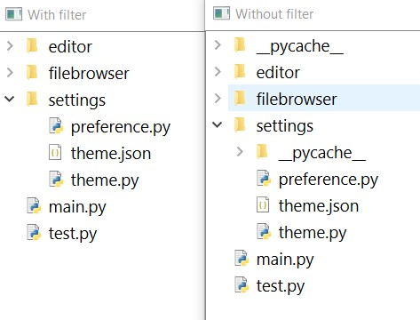

# PyQt based File System Widget

## Why

In QFileSystemModel you can not exclude a specific directory.

Here you can use glob patterns to stop a directory from showing
 
---

### Working

Uses QDirIterator to get files and directories inside a directory.

'fnmatch' module is used to check if a directory is excluded or not.

---

## Features and TODO
- [x] View a directory
- [x] Use glob patterns to stop a directory from showing
- [ ] Lazy loading
- [ ] Watch for file changes

---

## Examples

1. View a directory

```python
from fswidget import FSWidget
...

...
win = FSWidget('.') # opens the current working directory
win.show()
...
```

2. Use custom icon provider
```python
from fswidget import FSWidget
...

class CustomIconProvider(QtWidgets.QFileIconProvider):
    # makes it so that pdf files have python icon besides them
    def icon(self, info: QtCore.QFileInfo) -> QtGui.QIcon:
        if info.suffix() == 'pdf':
            return super().icon(QtCore.QFileInfo('anthing.py'))
        return super().icon(info)


...
win = FSWidget(directory)

win.icon_provider = CustomIconProvider()
win.load_icons() # do this to see changes

win.show()
...
```

3. Using filters to not show certain directories
```python
from fswidget import FSWidget
...

patterns = [
    '*/__pycache__',
    '*/dist'
]

...
win = FSWidget(directory, patterns)
win.show()
...
```
---
